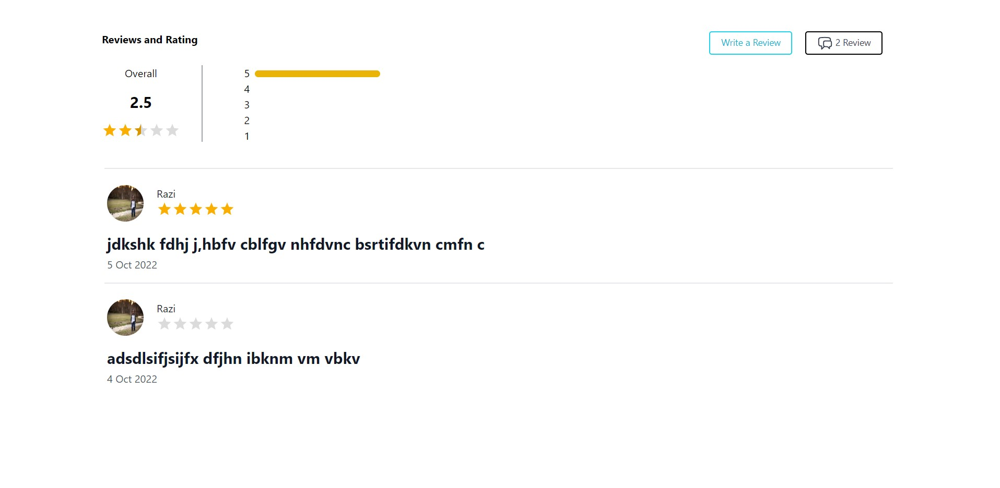

# ReviewsAndRating

## Table of contents

- [Introduction](#introduction)
- [Demo](#demo)
- [Run](#run)
- [Technology](#technology)
- [Features](#features)
- [License](#license)

## Introduction

A virtual review and rating website using Node js, Express js, MongoDb and react js.

NOTE: Please read the RUN section before opening an issue.

## Demo

The website resembles that  you can add review and rating to products in your website.

## Run

To run this application, you have to set your own environmental variables. For security reasons, some variables have been hidden from view and used as environmental variables with the help of dotenv package. Below are the variables that you need to set in order to run the application:

- MONGODB_URL: This is the mongodg data base url (string).

After you've set these environmental variables in the .env file at the root of the project, and intsall node modules using  `npm install`

Now you can run frontend `npm start` in the terminal and the application should work.

Now you can run backent `npm start` in the terminal and the application should work.

## Technology

The application is built with:

- Node.js 
- MongoDB
- Express 
- React js
- tailwind

## Features

Users can do the following:

- User can add review and rating for the products

## License

- Copyright 2022 © [Muhammed Razi BK](https://github.com/RAZIBK)
